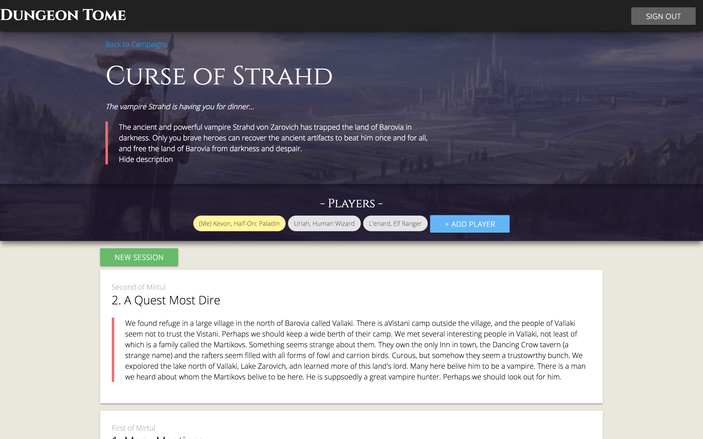
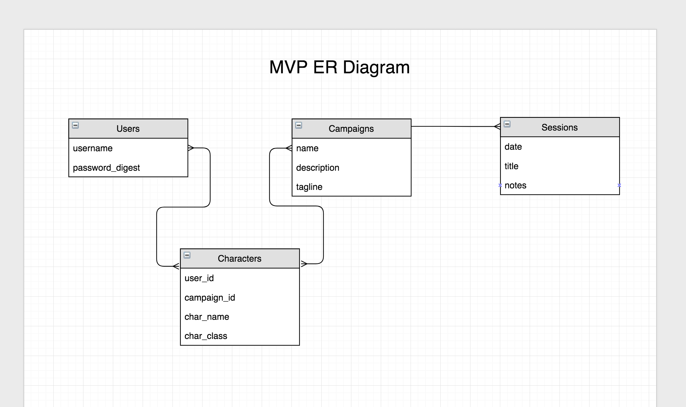

# Dungeon Tome

Dungeon Tome is a companion web app to used alongside tabletop roleplaying games (like Dungeons & Dragons). Users can join with the other members of their gaming groups and track their campaigns, quests and characters.



## Technologies

Dungeon Tome has a Ruby on Rails backend with a PostgreSQL database.

The front end is React.js running with webpacker and React Router v4.

## Ruby Version

2.3.4

## Live Demo

[Dungeon Tome](https://dungeon-tome.herokuapp.com/)

You may use these dummy accounts to test the Add Player functionality:
* demo1
* demo2
* demo3

## ER Diagram



## Get Started

Clone the master branch to a new directory.

```bash
$ cd dungeon-tome
$ bundle              # install dependencies
$ rake db:create      # initialize the database
$ rake db:migrate     # run migrations
$ rake                # run the test suite
```

## Usage

In one terminal window:

```bash
$ rake db:seed      # (optional) seed the database with example data
$ rails s           # start the rails server
```

In a separate terminal window:

```bash
$ ./bin/webpack-dev-server    # starts webpack
```

Visit http://localhost:3000/ in your web browser.

## TODO

* Improve mobile-friendly features
* Make sessions editable and deletable by all members of a campaign
* Add additional information for characters
* Add a loot tracking system to campaigns
* Add "Dungeon Master" admin functionality to campaigns
